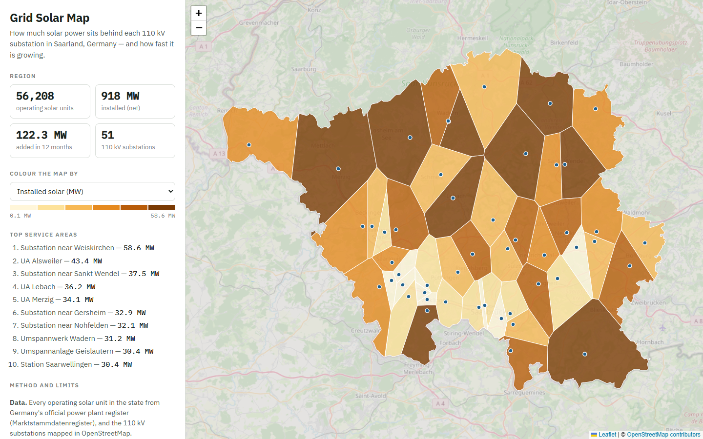
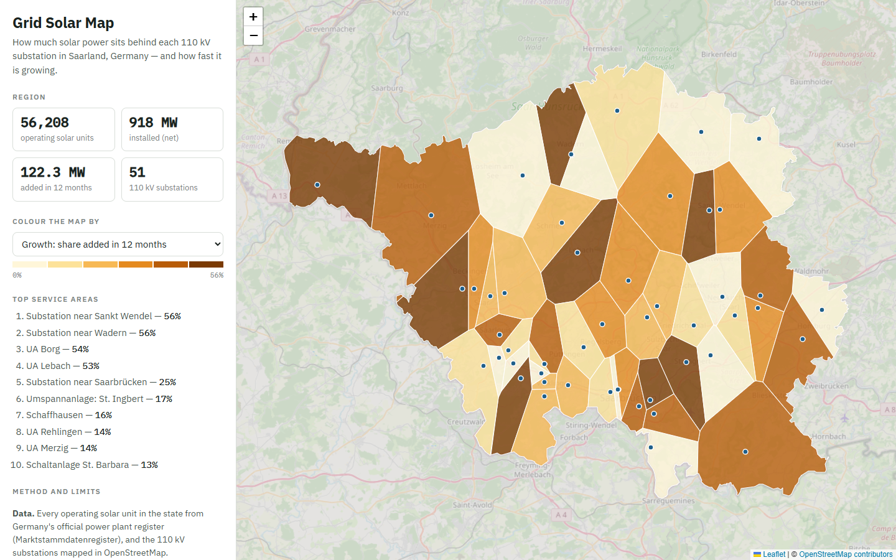
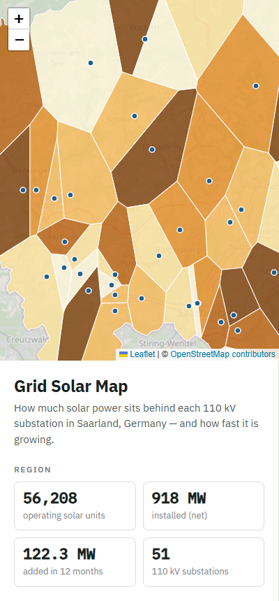

# Grid Solar Map

**How much solar power sits behind each 110 kV substation — and how fast it is growing.**

An open-data map of Saarland, Germany, built from the country's official power plant register and OpenStreetMap. It shows where rooftop and ground-mounted solar concentrates in the distribution grid, which areas grew fastest in the last year, and how the numbers were derived.



## Why this matters

Germany has close to five million registered solar units. Most are small rooftop systems connected to the low- and medium-voltage grid, which was built to deliver power, not to receive it. Grid operators need to know where generation is piling up before voltage and transformer limits are reached.

This project answers a first-screen question: *which substation areas carry the most solar, and where is it growing fastest?* It is the same question I work on professionally with distribution-generation and transformer data at a Brazilian utility, applied here to public German data.

## Results (snapshot 9 February 2025)

| | |
|---|---|
| Operating solar units in Saarland | **56,208** |
| Installed net capacity | **918 MW** |
| Added in the previous 12 months | **122 MW** (+15%) |
| 110 kV substations (service areas) | **51** |
| Units placed on the map | **99.99%** (7 without a usable location) |
| Median distance from a unit to its substation | **2.4 km** |

Some service areas added more than half of their solar capacity in a single year:



## How it works

```
Marktstammdatenregister (4.95 M solar units, 723 MB)      OpenStreetMap (Overpass API)
            │                                                        │
   1. extract_solar.py                                        2. fetch_osm.py
   stream the zip in chunks,                        110 kV substations, municipality and
   keep one state, clean types                      postcode centres, state boundary
            │                                                        │
            └──────────────────────┬─────────────────────────────────┘
                                   │
                        3. build_areas.py
            place each unit, assign it to the nearest substation,
            build Voronoi service areas clipped to the state,
            aggregate capacity, growth, density and rooftop share
                                   │
                        4. web/index.html
                interactive map (Leaflet), no backend
```

1. **Extract.** The national file has 4.95 million rows. It is read straight from the zip in chunks of 200,000 rows, so it never has to be unzipped or loaded into memory at once. Only operating units are kept.
2. **Grid and places.** 110 kV substations (*Umspannwerke*) are where the high-voltage grid feeds the distribution grid; each one becomes the centre of a service area.
3. **Assign and aggregate.** Each unit is placed at its exact coordinates when published, otherwise at the centre of its postcode area, otherwise at its municipality centre. It is then assigned to the nearest substation with a k-d tree. Service areas are Voronoi cells clipped to the state boundary; their areas add up to 2,572 km², matching Saarland's official size.
4. **Map.** A static page reads three small GeoJSON/JSON files, so it can be hosted anywhere (GitHub Pages).

## Limits — read before using the numbers

- **Location of small units.** Only 3.1% of units have published coordinates; small rooftop systems are anonymised for privacy. 96.9% are placed at their postcode centre, which is accurate at the area level but not at the street level.
- **Grid topology is approximate.** Real feeder and substation assignments are not public. Nearest-substation (Voronoi) is a standard first approximation, not the operator's actual layout.
- **No hosting capacity.** Transformer ratings and line limits are not public, so this is a screening map of where solar concentrates and grows, not a hosting-capacity or reinforcement calculation.
- **Snapshot date.** The register dump is from 9 February 2025 (the most recent open-MaStR release at the time of building).

## Run it yourself

```bash
python -m venv .venv
.venv/Scripts/activate          # Windows  (Linux/macOS: source .venv/bin/activate)
pip install -r requirements.txt

cd pipeline
curl -L -o ../data/raw/bnetza_mastr_solar_raw.csv.zip "https://zenodo.org/records/14843222/files/bnetza_mastr_solar_raw.csv.zip?download=1"
python extract_solar.py         # ~5 min, low memory
python fetch_osm.py
python build_areas.py

cd ../web && python -m http.server 8000   # open http://localhost:8000
```

To map another state, change `STATE_NAME` and `STATE_ISO` in `pipeline/config.py`.

## Mobile

The page works on phones: the map comes first, the figures and ranking below.



## Data and licences

- Solar units: © Bundesnetzagentur, [Marktstammdatenregister](https://www.marktstammdatenregister.de), licence [dl-de/by-2-0](https://www.govdata.de/dl-de/by-2-0); bulk data processed by [open-MaStR](https://github.com/OpenEnergyPlatform/open-MaStR) and published on [Zenodo](https://zenodo.org/records/14843222).
- Substations, boundaries and base map: © [OpenStreetMap contributors](https://www.openstreetmap.org/copyright), ODbL.
- Code: MIT licence.

## About

Built by **Michael Hiarley**, electrical engineering student at the Federal University of Ceará (Brazil) and automation & data developer in power distribution. Stack: Python (pandas, SciPy, Shapely), Overpass API, Leaflet.
