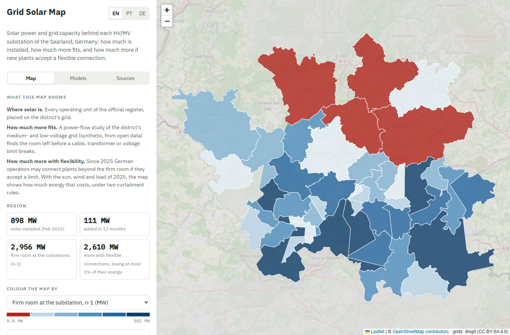
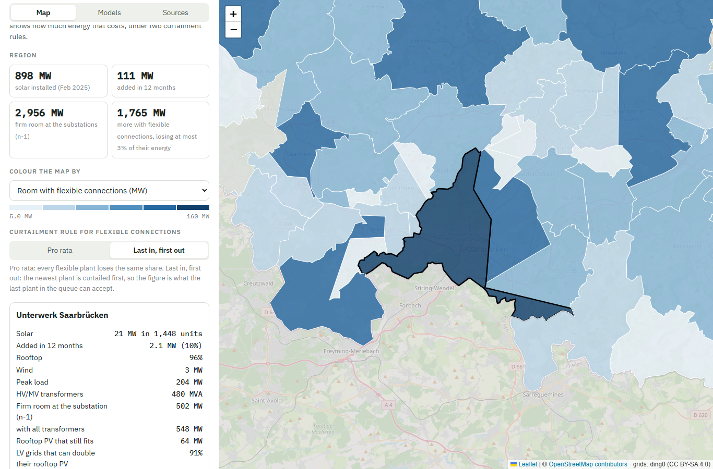

# Grid Solar Map

**How much solar power sits behind each HV/MV substation of the Saarland, how much more the grid can take, and how much more if new plants accept a flexible connection.**

An open-data map of the Saarland, Germany. It combines the country's official power plant register with synthetic medium- and low-voltage grids built from open data, and a power-flow study of those grids. In English, Portuguese and German.

**[Open the map →](https://maycu-byte.github.io/grid-solar-map/)**



## Why this matters

- German distribution grids receive far more connection requests than they can promise. In 2025 grid operators received requests for 406.8 GW of large batteries in the distribution grids and committed 26.9 GW ([Bundesnetzagentur monitoring, pv magazine](https://www.pv-magazine.de/2026/08/25/netzanschluesse-fuer-batteriespeicher-574-gigawatt-angefragt-54-gigawatt-zugesagt/)).
- EU law now requires distribution system operators to publish the capacity available for new connections with high spatial granularity, including where flexible connections are possible ([Regulation (EU) 2024/1747](https://eur-lex.europa.eu/eli/reg/2024/1747/oj/eng)).
- Since February 2025 German operators may offer a *flexible Netzanschlussvereinbarung* (§ 17 (2b) EnWG): a plant connects beyond the firm capacity if it accepts a static or dynamic limit.

This map shows, per substation area, where solar is, how much firm room is left, and how much more fits flexibly and at what loss of energy.

It also draws the grid itself:
- **the real high-voltage grid** from OpenStreetMap: 380, 220 and 110 kV lines and cables, and the 16.7 Hz railway lines;
- **the modelled medium-voltage network** of the ding0 grids, coloured by loading in the worst feed-in case;
- **every MV/LV transformer** (5,887), coloured by the rooftop solar behind it per kVA of transformer, or by its loading; black rings mark the 42 that the solar of 2025 already required to reinforce. ding0 draws each line straight between its two buses, so feeders fan out from the substation instead of following streets.

## Results (register of 10 February 2025, weather of 2025)

| | |
|---|---|
| Solar placed on the 46 districts with grid data | **898 MW** (572 MW rooftop, 326 MW ground-mounted) |
| Added in the 12 months before the snapshot | **111 MW** in these districts (122 MW in the whole state) |
| Firm room for new feed-in at the HV/MV substations, n-1 | **2,956 MW** |
| Districts with no firm room left | **4** |
| More with flexible connections, losing at most 3% of their energy | **2,610 MW** pro rata, **1,765 MW** last in, first out |
| LV grids that can at least double their rooftop PV | **86%** of 3,852 |

The curtailment rule decides about 850 MW: shared equally, flexible plants fit far more than if the newest plant in the queue is always curtailed first.



## How it works

```
Marktstammdatenregister (open-MaStR)     OpenStreetMap          ding0 grids (eGo^n, Zenodo)
            │                                  │                          │
   1. extract_solar.py                 2. fetch_osm.py                    │
            │                                  │                          │
            └──────────────┬───────────────────┘                          │
                           │                                              │
                 3. build_areas.py (register summary)                     │
                           │                                              │
                           │      lv-grid-stress-test/regional/  ◄────────┘
                           │      register on the grids, firm and flexible capacity,
                           │      validation against full power flows
                           │                          │
                           └──────► 4. build_capacity.py (data/grid/) ◄───┘
                                              │
                                   5. web/ (Leaflet, no backend)
```

1. **Extract.** The national register is read from the zip in chunks; only operating units of the state are kept.
2. **Places and lines.** 110 kV substations, postcode and municipality centres and the state boundary from OpenStreetMap (`fetch_osm.py`); every power line and cable of the state (`fetch_power_lines.py`).
3. **Register summary.** Snapshot date and state totals.
4. **Grid capacity.** The power-flow study lives in [lv-grid-stress-test](https://github.com/maycu-byte/lv-grid-stress-test/blob/main/docs/regional.md): the ding0 grids of 46 of the 47 MV grid districts, the register placed on them, firm capacity per LV grid and per substation (n-1), and flexible connections over the hours of 2025. `build_capacity.py` joins its results (`data/grid/`) with the district shapes and names each district after the substation inside it.
5. **Map.** A static page reads three small files. Each file is fetched with a version made from the content of the page's files (`web/stamp.sh`), so a browser never mixes an old and a new file.

## Limits: read before using the numbers

- **The grids are synthetic.** ding0 builds grids from open data and planning rules, not from the operators' records. The capacities are a screening estimate.
- **Location of small units.** 97% of the units publish only a postcode. Their capacity is spread over the buildings of an approximate postcode area.
- **District 33392** (51 km², about 2% of the state) is not in the ding0 release and is shown without grid data.
- **The queue is not public.** The register's units "in planning" (16 MW) do not stand for it, so the map shows room, not waiting lists.
- **Flexible connections are evaluated at the substation**, with a 5% reserve after checking the model against full power flows. The feeder a plant uses and the 110 kV grid above are outside the study.

## Run it yourself

```bash
python -m venv .venv
.venv/Scripts/activate          # Windows  (Linux/macOS: source .venv/bin/activate)
pip install -r requirements.txt

cd pipeline
curl -L -o ../data/raw/bnetza_mastr_solar_raw.csv.zip "https://zenodo.org/records/14843222/files/bnetza_mastr_solar_raw.csv.zip?download=1"
python extract_solar.py
python fetch_osm.py
python build_areas.py
python fetch_power_lines.py     # or: python fetch_power_lines.py <saved Overpass answer>
python build_capacity.py        # reads data/grid/, produced by lv-grid-stress-test/regional
# MV network and transformers: lv-grid-stress-test/regional/export_map.py → web/data/

cd ../web && sh stamp.sh && python -m http.server 8000   # open http://localhost:8000
```

## Mobile

On a phone the map comes first, the panel below.


## Data and licences

- Solar units: © Bundesnetzagentur, [Marktstammdatenregister](https://www.marktstammdatenregister.de), licence [dl-de/by-2-0](https://www.govdata.de/dl-de/by-2-0); bulk data by [open-MaStR](https://github.com/OpenEnergyPlatform/open-MaStR), [Zenodo](https://zenodo.org/records/14843222).
- Grids: ding0 v0.3.0-alpha, eGo^n project, [doi:10.5281/zenodo.10405129](https://doi.org/10.5281/zenodo.10405129), CC BY-SA 4.0. The capacity results in `data/grid/` and the district layer derive from it and are shared under CC BY-SA 4.0.
- Weather: Open-Meteo historical archive, ERA5 reanalysis, CC BY 4.0. Load shape: Energy-Charts (Fraunhofer ISE).
- Substations, boundaries and base map: © [OpenStreetMap contributors](https://www.openstreetmap.org/copyright), ODbL.
- Code: MIT licence.

## About

Built by **Michael Hiarley Silva Andrade**, electrical engineering student at the Federal University of Ceará (Brazil) and automation and data developer in power distribution. Related: [lv-grid-stress-test](https://github.com/maycu-byte/lv-grid-stress-test) (the power-flow study) and [grid-edge-gateway](https://github.com/maycu-byte/grid-edge-gateway) (the site controller that enforces a flexible connection).
